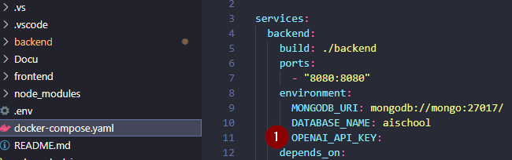
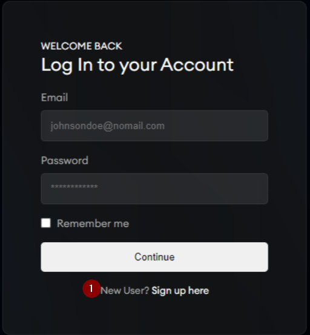
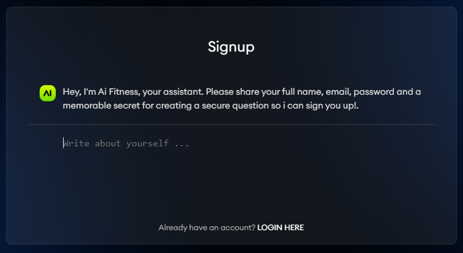

<!-- PROJECT LOGO -->
 

  

  <h3 align="center">AI Fitness Assistant</h3>
  

     
    <a href="Docu/AI_Fitness_doku.pdf" target=”_blank”><strong>Explore the docs »</strong></a>
  

<!-- GETTING STARTED -->
# Requirements

1. To run this project locally, a Docker daemon is required.
We recommend having [Docker Dektop](https://www.docker.com/products/docker-desktop/) as there is no further setup required.

2. An OpenAI API-key is necessary to use the functionality.
To use it, go to the `/docker-compose.yaml` file and insert it at `OPEN_API_KEY:`

## Local setup

1. Clone the project to your local machine. Either download the folder directly from Github or clone it via `git clone`.

2. In your terminal, change to the general directory of the project where you can also find the `docker-compose.yaml` file.

3. Make sure that your Docker daemon is running. Now execute the command `docker-compose up` and the app will start the build process.

  $ git clone https://github.com/youssefcamao/AIFitness.git
  $ docker-compose up

## Using the app

1. Go to [localhost:80](localhost:80)

2. Open the chat link with the button `Try it now`.

3. Go to `Sign up here`

4. Type in the request data: `name, email, security question and answer`
Use any kind of dummy data, there is no actual email verification process.

5. You should be logged in now. If you want to log out and back in again, you need your email, password and the answer to your security question.
